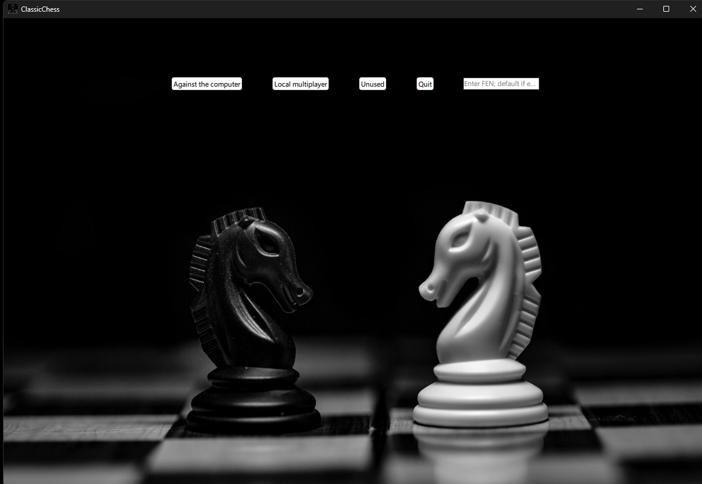
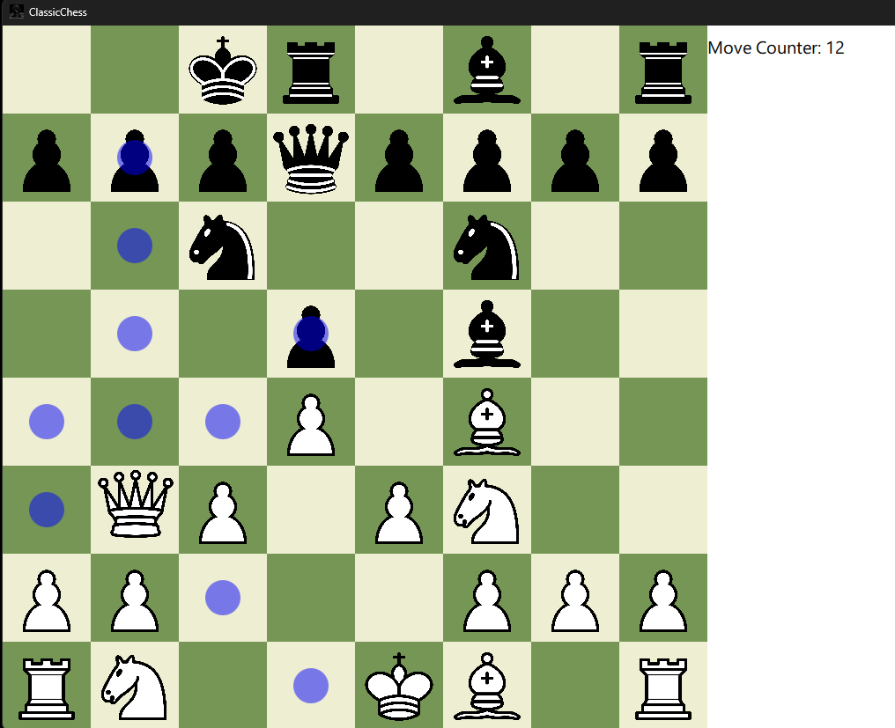

# ClassicChess

## About The Project
A classic chess game with a ability to play against a computer or a local multiplayer with a friend.

# Implemented:
- Main menu with the ability to play against a computer or a local multiplayer
- A opponent for the you to play against, the opponent makes random valid moves
- All the pieces and pawns work the way they should, according to the chess rules
- Ability to castle
- Ability to promote pawns to pieces if they get to the other side of the game board
- A move counter for total moves in the game.
- A game always ends to either win, draw (stalemate) or a lose.
- After the game player can restart the match or go back to the game menu.

## Screenshots

### Built With
- C++
- Qt Framework (UI designed with QML)

## Getting Started
Download the latest binaries from the releases section or build the project from source, available here on GitHub.

### Prerequisites
- Windows 11 or 10 (64-bit)
- OpenGL-capable GPU

## Extra prerequisites for compiling
- Qt 6.0+
- C++ compiler (C++17 standard)
- QML Creator
- CMake

## License
This software and its accompanying binaries are distributed under the GPL-3.0 license. By using, distributing, or contributing to this software, you agree to the terms and conditions of this license. A copy of the GPL-3.0 license is provided [here](./LICENSE).

## Acknowledgments
This software utilizes the Qt Framework, distributed under the LGPL, and other open-source libraries. Their use is in accordance with the licensing terms and compatible with the GPL-3.0 under which ClassicChess is distributed.

## Disclaimer
ClassicChess is provided "as is", without warranty of any kind. See the GPL-3.0 license for more details.